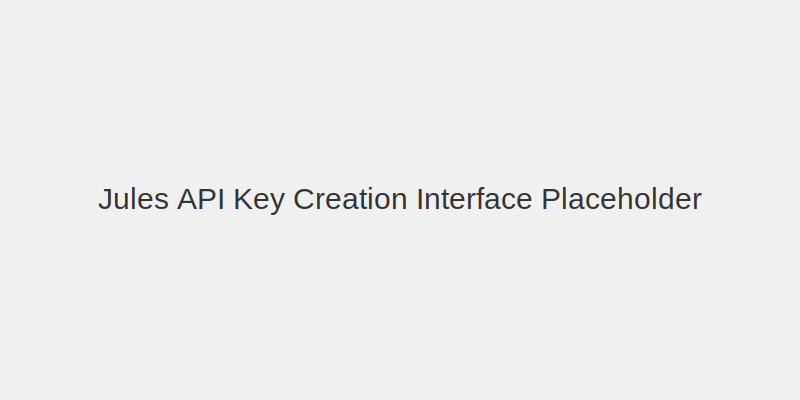

# Introduction

The Jules API lets you programmatically access Jules's capabilities to automate and enhance your software development lifecycle. You can use the API to create custom workflows, automate tasks like bug fixing and code reviews, and embed Jules's intelligence directly into the tools you use every day, such as Slack, Linear, and GitHub.

> **Note:** The Jules API is in an alpha release, which means it is experimental. Be aware that we may change specifications, API keys, and definitions as we work toward stabilization. In the future, we plan to maintain at least one stable and one experimental version.

## Authentication

To get started with the Jules API, you'll need an API key.

### Generate Your API Key

In the Jules web app, go to the Settings page to create a new API key.



### Use Your API Key

To authenticate your requests, pass the API key in the `X-Goog-Api-Key` header of your API calls.

> **Important:** Keep your API keys secure. Don't share them or embed them in public code. For your protection, any API keys found to be publicly exposed will be automatically disabled to prevent abuse.

## API Concepts

The Jules API is built around a few core resources. Understanding these will help you use the API effectively.

### Source

An input source for the agent (e.g., a GitHub repository). Before using a source using the API, you must first install the Jules GitHub app through the Jules web app.

### Session

A continuous unit of work within a specific context, similar to a chat session. A session is initiated with a prompt and a source.

### Activity

A single unit of work within a Session. A Session contains multiple activities from both the user and the agent, such as generating a plan, sending a message, or updating progress.

## Quickstart: Your First API Call

We'll walk through creating your first session with the Jules API using curl.

### Step 1: List Your Available Sources

First, you need to find the name of the source you want to work with (e.g., your GitHub repo). This command will return a list of all sources you have connected to Jules.

```bash
curl 'https://jules.googleapis.com/v1alpha/sources' \
    -H 'X-Goog-Api-Key: YOUR_API_KEY'
```

The response will look something like this:

```json
{
  "sources": [
    {
      "name": "sources/github/bobalover/boba",
      "id": "github/bobalover/boba",
      "githubRepo": {
        "owner": "bobalover",
        "repo": "boba"
      }
    }
  ],
  "nextPageToken": "github/bobalover/boba-web"
}
```

### Step 2: Create a New Session

Now, create a new session. You'll need the source name from the previous step. This request tells Jules to create a boba app in the specified repository.

```bash
curl 'https://jules.googleapis.com/v1alpha/sessions' \
    -X POST \
    -H "Content-Type: application/json" \
    -H 'X-Goog-Api-Key: YOUR_API_KEY' \
    -d '{
      "prompt": "Create a boba app!",
      "sourceContext": {
        "source": "sources/github/bobalover/boba",
        "githubRepoContext": {
          "startingBranch": "main"
        }
      },
      "title": "Boba App"
    }'
```

The response will look something like this:

```json
{
  "name": "sessions/31415926535897932384",
  "id": "31415926535897932384",
  "title": "Boba App",
  "sourceContext": {
    "source": "sources/github/bobalover/boba",
    "githubRepoContext": {
      "startingBranch": "main"
    }
  },
  "prompt": "Create a boba app!"
}
```

By default, sessions created through the API will have their plans automatically approved. If you want to create a session that requires explicit plan approval, set the `requirePlanApproval` field to `true`.

### Step 3: Listing Sessions

You can list your sessions as follows.

```bash
curl 'https://jules.googleapis.com/v1alpha/sessions?pageSize=5' \
    -H 'X-Goog-Api-Key: YOUR_API_KEY'
```

### Step 4: Approve Plan

If your session requires explicit plan approval, you can approve the latest plan as follows:

```bash
curl 'https://jules.googleapis.com/v1alpha/sessions/SESSION_ID:approvePlan' \
    -X POST \
    -H "Content-Type: application/json" \
    -H 'X-Goog-Api-Key: YOUR_API_KEY'
```

### Step 5: Activities and Interacting with the Agent

To list activities in a session:

```bash
curl 'https://jules.googleapis.com/v1alpha/sessions/SESSION_ID/activities?pageSize=30' \
    -H 'X-Goog-Api-Key: YOUR_API_KEY'
```

To send a message to the agent:

```bash
curl 'https://jules.googleapis.com/v1alpha/sessions/SESSION_ID:sendMessage' \
    -X POST \
    -H "Content-Type: application/json" \
    -H 'X-Goog-Api-Key: YOUR_API_KEY' \
    -d '{
      "prompt": "Can you make the app corgi themed?"
    }'
```